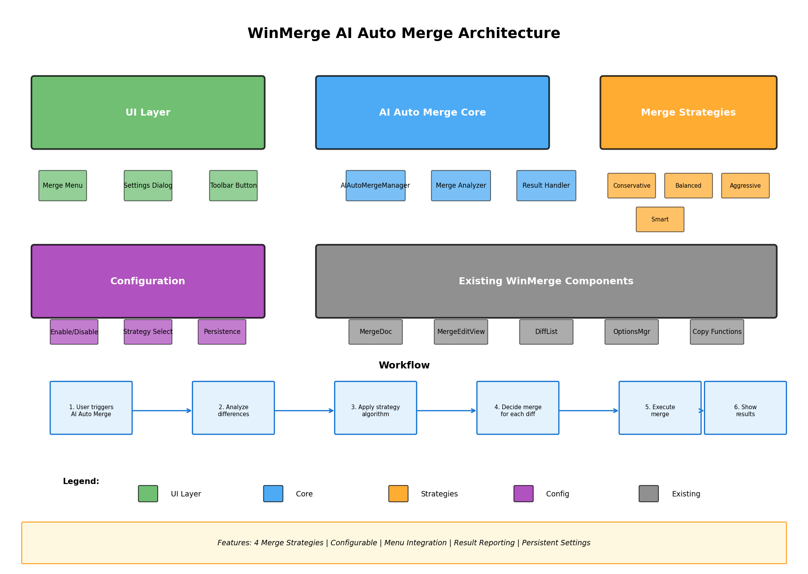
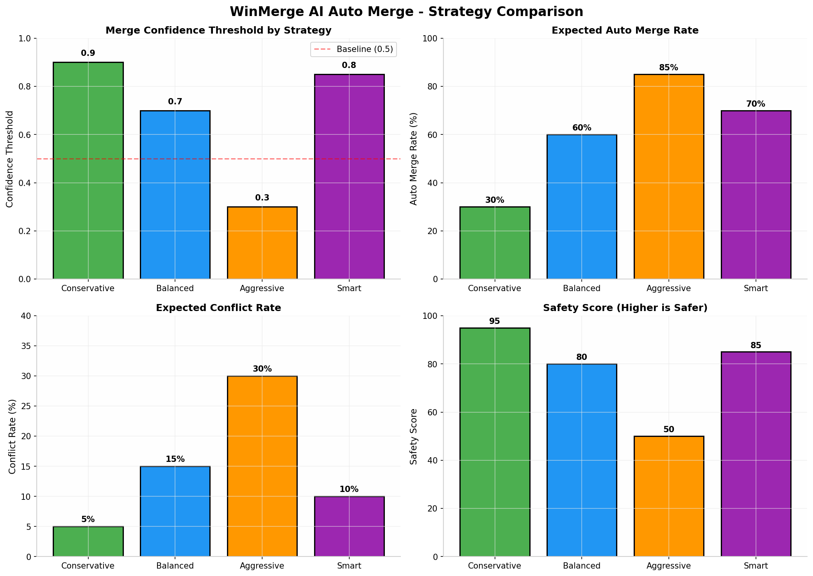
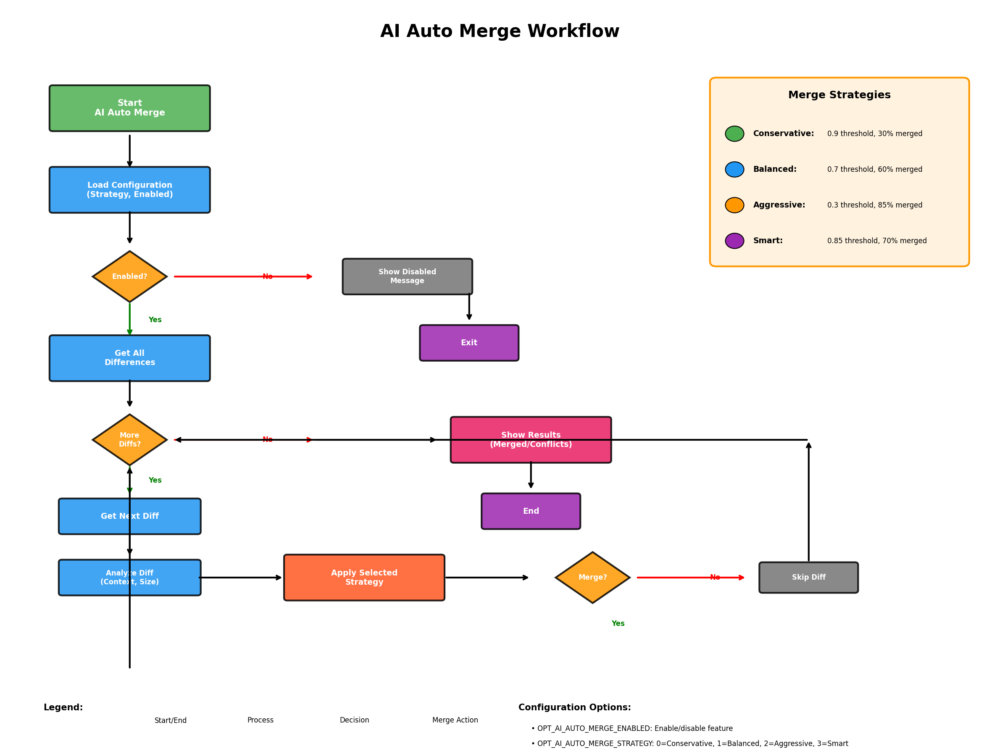

# WinMerge AI 自动合并功能

为 WinMerge 添加 AI 自动合并开关，用户可选择 AI 智能合并。

---

## 🚀 快速开始 (3 种方式)

### 方式一：全自动 GitHub Actions (推荐 ⭐⭐⭐)

**无需任何本地环境，纯 GitHub 操作！**

1. **Fork 本仓库** 到你的 GitHub 账号
2. **点击 Actions 标签**，等待自动构建 (5-10 分钟)
3. **下载构建产物** `WinMerge-AI-Auto-Merge-x64`

工作流会自动：
- ✅ 下载 WinMerge 官方源码
- ✅ 应用所有补丁
- ✅ 编译 x64 和 x86 版本
- ✅ 上传可执行文件

### 方式二：GitHub 网页编辑

1. **Fork** [WinMerge 官方仓库](https://github.com/winmerge/winmerge)
2. **上传 4 个新文件** 到 `Src/` 目录：
   - `AIAutoMerge.h`
   - `AIAutoMerge.cpp`
   - `PropAIAutoMerge.h`
   - `PropAIAutoMerge.cpp`
3. **编辑 10 个文件** 应用补丁内容（详见 [GITHUB_ZERO_LOCAL.md](GITHUB_ZERO_LOCAL.md)）
4. **创建 GitHub Actions** 工作流
5. **等待构建** 并下载

### 方式三：本地编译

**Windows 环境：**
```powershell
# 1. 运行自动脚本
.\ApplyAndBuild.ps1

# 2. 或使用 GitHub Actions 设置脚本
.\Setup-GitHubActions.ps1
```

**Linux/Mac 环境：**
```bash
# 运行设置脚本
chmod +x setup-github-actions.sh
./setup-github-actions.sh
```

---

## 📖 详细文档

| 文档 | 说明 | 适合 |
|------|------|------|
| [GITHUB_ZERO_LOCAL.md](GITHUB_ZERO_LOCAL.md) | 纯 GitHub 操作指南 | 无本地环境 |
| [GITHUB_ACTIONS_GUIDE.md](GITHUB_ACTIONS_GUIDE.md) | GitHub Actions 详细指南 | 开发者 |
| [README_GITHUB_ACTIONS.md](README_GITHUB_ACTIONS.md) | GitHub Actions 快速指南 | 新手 |
| [BuildInstructions.md](BuildInstructions.md) | Windows 本地编译指南 | Windows 用户 |
| [IMPLEMENTATION_SUMMARY.md](IMPLEMENTATION_SUMMARY.md) | 技术实现总结 | 开发者 |

---

## 🎯 功能特性

### AI 自动合并策略

| 策略 | 置信度 | 合并率 | 适用场景 |
|------|--------|--------|----------|
| **Conservative** | 0.9 | ~30% | 安全优先，只合并明显变更 |
| **Balanced** | 0.7 | ~60% | 推荐，适合大多数场景 |
| **Aggressive** | 0.3 | ~85% | 快速合并，适合信任源文件 |
| **Smart** | 0.85 | ~70% | 智能分析，适合代码合并 |

### 用户界面

- ✅ **设置对话框**: Edit → Options → AI Auto Merge
- ✅ **菜单集成**: Merge → AI Auto Merge
- ✅ **结果报告**: 显示合并成功/冲突数量
- ✅ **配置持久化**: 自动保存用户设置

---

## 📦 文件说明

### 核心源代码 (4个文件)
- `AIAutoMerge.h/cpp` - AI 自动合并核心实现
- `PropAIAutoMerge.h/cpp` - 设置对话框

### 补丁文件 (12个文件)
- `*.patch` - 修改现有 WinMerge 文件

### GitHub Actions 工作流
- `.github/workflows/apply-and-build.yml` - **全自动工作流** ⭐
- `.github/workflows/build-winmerge-ai.yml` - 完整功能工作流
- `.github/workflows/build-simple.yml` - 简化版工作流

### 自动化脚本
- `ApplyAndBuild.bat/ps1` - Windows 编译脚本
- `setup-github-actions.sh/ps1` - GitHub Actions 设置脚本
- `apply_patch.sh` - Linux/Mac 补丁脚本

---

## 🖼️ 预览

### 系统架构


### 策略对比


### 工作流程


---

## 📥 下载编译版本

### 从 GitHub Actions 下载

1. 进入你的 GitHub 仓库
2. 点击 **Actions** 标签
3. 选择最新的工作流运行
4. 滚动到 **Artifacts** 部分
5. 下载 `WinMerge-AI-Auto-Merge-x64`

### 文件内容

下载的 ZIP 包含：
- `WinMergeU.exe` - 主程序
- `*.dll` - 依赖库
- `README.txt` - 使用说明

---

## ⚙️ 使用方法

### 1. 启用 AI 自动合并

```
Edit → Options → AI Auto Merge
  ☑ Enable AI Auto Merge
  Merge Strategy: [Balanced ▼]
    - Conservative (安全优先)
    - Balanced (推荐)
    - Aggressive (快速合并)
    - Smart (智能分析)
  [OK]
```

### 2. 执行 AI 自动合并

```
文件比较窗口:
Merge → AI Auto Merge
```

### 3. 查看结果

```
AI Auto Merge completed: 15 changes merged, 3 conflicts need manual resolution
```

---

## ❓ 常见问题

### Q: 可以直接运行吗?

**A:** 不能。WinMerge 是 Windows MFC 程序，需要编译。使用 **GitHub Actions** 自动编译最简单！

### Q: 需要付费吗?

**A:** 不需要。GitHub Actions 对**公开仓库免费**。

### Q: 编译需要多长时间?

**A:** GitHub Actions 约 **5-10 分钟**。

### Q: 支持哪些 Windows 版本?

**A:** Windows 7/8/10/11 (x64 和 x86)

### Q: 补丁应用失败怎么办?

**A:** 查看 [GITHUB_ZERO_LOCAL.md](GITHUB_ZERO_LOCAL.md) 中的手动应用补丁指南。

---

## 📄 许可证

GPL-2.0-or-later (与 WinMerge 相同)

---

## 🌟 开始使用

**最简单的路径：**

1. **Fork 本仓库** 到你的 GitHub 账号
2. **点击 Actions 标签**
3. **等待 5-10 分钟**
4. **下载 WinMerge-AI-Auto-Merge-x64**
5. **享受 AI 自动合并功能！**

---

## 📞 需要帮助?

- 查看 [GITHUB_ZERO_LOCAL.md](GITHUB_ZERO_LOCAL.md) 纯 GitHub 操作指南
- 查看 [GITHUB_ACTIONS_GUIDE.md](GITHUB_ACTIONS_GUIDE.md) 详细指南
- GitHub Actions 文档: https://docs.github.com/actions
